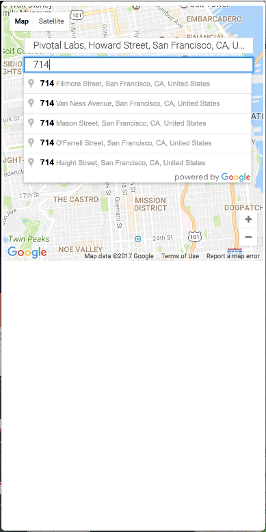
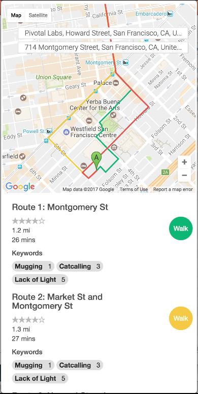

# Safe Route: Our entry for the 2017 All-Women Hackathon

## Description
This is a branch of the code for the app that my team built during the [2017 All-Women Hackathon](https://www.eventbrite.com/e/womenhack-the-all-women-hackathon-san-francisco-tickets-27670276542).

## Selected Challenge: Women Safety
Women are particularly vlunerable on the street. Certain harassments are often specific to gender, such as catcalling, sexual assault, and kidnapping. They are also time sensitive, since many areas are far safer in the daytime than nighttime. Routes generated from maps like Google don't indicate what one may encounter on the street. My team intended to create a web app that will let user to choose a route that is best for their time of travel and gender.

## Solution
The app lets user enter their location, destination, and time of travel. Using Google Map API, it will create a route with alternative option, but it will also include safety rating. The rating include keywords indicating crime and color-coded numbered circle indicating dangerous level, both of which came from SFPL data and user feedback.

## Technology
The map are generated from Google Map API. The crime data are extracted real time from Socrata OpenData,  The backend is a mix of Flask and Express. The frontend is Bootstrap

## Contribution
Working with my teammates, Grace and Steph, we generated database parameters for the crime data and keywords for the user feedback.
I research into the SFPD crime OpenData, then extracted and filtered the JSON data with SoQL (system-specific version of SQL), ES6 higher order functions, and REST according to the database parameters that my teammate and I decided beforehand. My part of the script can be found at 

## Final Product

